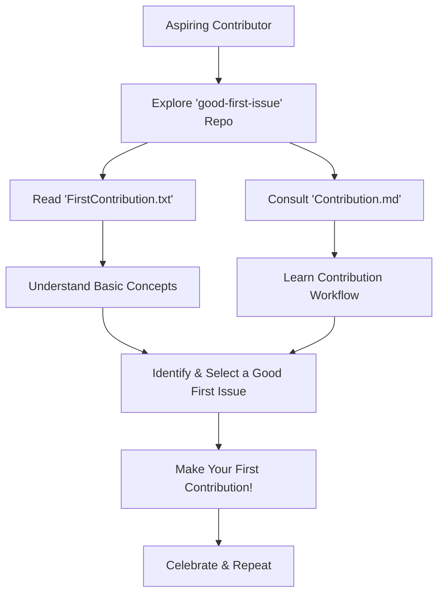

# 🚀 good-first-issue

## Short Description
Welcome to `good-first-issue`, your premier destination for demystifying the world of open-source contributions! This repository is meticulously crafted to be a supportive guide for new developers, students, and anyone eager to make their first meaningful contribution to an open-source project. We break down the intimidating process into clear, actionable steps, ensuring a smooth and empowering entry into the vibrant open-source community.

## ✨ Key Features
*   **Beginner-Focused Guides:** Dive into `FirstContribution.txt` for a gentle introduction tailored specifically for newcomers.
*   **Comprehensive Contribution Workflow:** `Contribution.md` provides detailed, step-by-step instructions on how to effectively contribute to projects.
*   **Empowering Learning Experience:** Designed to build confidence and practical skills necessary for open-source engagement.
*   **Community-Driven Principles:** Fosters an environment that encourages learning, collaboration, and growth for all.

## Who is this for?
This project is an essential resource for:
*   **New Developers:** Looking to make their very first open-source contribution.
*   **Students:** Seeking hands-on experience with Git, GitHub, and collaborative development.
*   **Aspiring Open-Source Enthusiasts:** Who want clear, structured guidance to kickstart their journey.
*   **Mentors & Project Maintainers:** As a reference to point new contributors towards a comprehensive guide.

## Technology Stack & Architecture
This repository functions as a structured collection of documentation, primarily utilizing:
*   **Markdown:** For richly formatted, easy-to-read guides and instructions (`Contribution.md`, `README.md`).
*   **Plain Text:** For direct, no-frills introductory content (`FirstContribution.txt`).
*   **Git & GitHub:** As the foundational platform for version control, collaboration, and distribution of these educational resources.

The architecture is deliberately simple, prioritizing content accessibility and ease of navigation for its primary audience.

## 📊 Architecture & Database Schema
Given that this project is a documentation and resource repository, its "architecture" represents a logical flow for a contributor.



## ⚡ Quick Start Guide
Getting started with `good-first-issue` is straightforward:

1.  **Clone the Repository:**
    ```bash
    git clone https://github.com/Sanika2103/good-first-issue.git
    ```
2.  **Navigate to the Project Directory:**
    ```bash
    cd good-first-issue
    ```
3.  **Begin Your Open-Source Journey:**
    Open and thoroughly read `Contribution.md` and `FirstContribution.txt`. These files contain all the guidance you need to confidently make your first contribution.